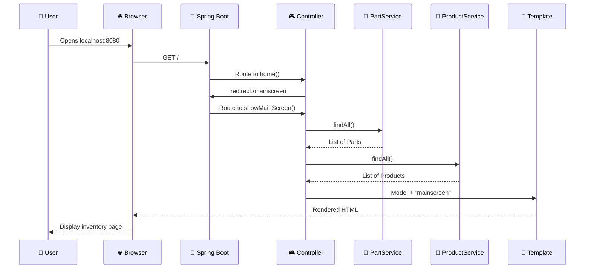

# 🏗️ Alfonso's Auto Parts Shop - Complete Project Overview

## 🎯 Quick Reference Schema

```
                    ALFONSO'S AUTO PARTS SHOP
                   ═══════════════════════════
                    Spring Boot Web Application
                         Port: 8080

┌─────────────────────────────────────────────────────────────────┐
│                         BROWSER VIEW                            │
│  🌐 http://localhost:8080/mainscreen                           │
│  ┌─────────────────────────────────────────────────────────┐   │
│  │  📋 PARTS INVENTORY TABLE                              │   │
│  │  • Engine ($1200.00) - Inv: 10, Min: 5, Max: 20       │   │
│  │  • Brake Pad ($45.00) - Inv: 25, Min: 10, Max: 50     │   │
│  │  • Oil Filter ($12.50) - Inv: 100, Min: 20, Max: 200  │   │
│  │                                                         │   │
│  │  📦 PRODUCTS TABLE                                      │   │
│  │  • Car Engine Kit ($2500.00) - Inv: 5                 │   │
│  │  • Brake System ($450.00) - Inv: 15                   │   │
│  │  • Maintenance Package ($89.99) - Inv: 50             │   │
│  └─────────────────────────────────────────────────────────┘   │
└─────────────────────────────────────────────────────────────────┘
                               ↕ HTTP
┌─────────────────────────────────────────────────────────────────┐
│                      SPRING BOOT SERVER                        │
│                                                                 │
│  🎮 MainscreenController                                       │
│  ├─ @GetMapping("/") → redirect to mainscreen                 │
│  └─ @GetMapping("/mainscreen") → show inventory               │
│                    ↕                                           │
│  💼 Service Layer                                              │
│  ├─ PartService (manages parts collection)                    │
│  └─ ProductService (manages products collection)              │
│                    ↕                                           │
│  📦 Entity Models                                              │
│  ├─ Part (id, name, price, inv, min, max)                    │
│  ├─ Product (id, name, price, inv)                           │
│  ├─ InhousePart extends Part (+ machineId)                   │
│  └─ OutsourcedPart extends Part (+ companyName)              │
│                                                                 │
│  🗄️ Data Storage: In-Memory Lists                             │
└─────────────────────────────────────────────────────────────────┘
```

## 🔧 Technology Stack Breakdown

| Layer | Technology | Component | Purpose |
|-------|------------|-----------|---------|
| **Frontend** | HTML5 + CSS + Thymeleaf | `mainscreen.html` | User interface |
| **Web** | Spring MVC | `MainscreenController` | Request handling |
| **Business** | Spring Services | `PartService`, `ProductService` | Business logic |
| **Domain** | Plain Java POJOs | `Part`, `Product` entities | Data models |
| **Data** | Java Collections | `List<Part>`, `List<Product>` | In-memory storage |
| **Framework** | Spring Boot | Auto-configuration | Application container |
| **Server** | Embedded Tomcat | Built-in server | HTTP handling |
| **Build** | Maven | `pom.xml` | Dependency management |

## 🚀 Application Flow Summary

```
1. START → InventoryApplication.main() 
           ↓
2. INIT  → Spring Boot creates service beans with sample data
           ↓
3. READY → Tomcat server starts on port 8080
           ↓
4. REQUEST → Browser calls GET /
           ↓
5. ROUTE → MainscreenController.home() redirects to /mainscreen
           ↓
6. PROCESS → MainscreenController.showMainScreen()
           ↓
7. DATA → Services return parts and products lists
           ↓
8. RENDER → Thymeleaf processes mainscreen.html template
           ↓
9. RESPONSE → HTML sent back to browser
```

## 📋 File Structure Mapped to Function

```
📁 Project Root
├── 🚀 src/main/java/com/example/inventory/
│   ├── 🏁 InventoryApplication.java ────────── Application Entry Point
│   ├── 🎮 MainscreenController.java ──────── Web Request Handler
│   ├── 📁 entity/
│   │   ├── 📦 Part.java ─────────────────── Core Data Model
│   │   └── 📦 Product.java ──────────────── Core Data Model
│   └── 📁 service/
│       ├── 💼 PartService.java ──────────── Business Logic
│       └── 💼 ProductService.java ───────── Business Logic
│
├── 🌐 src/main/resources/
│   └── templates/
│       └── 🎨 mainscreen.html ───────────── User Interface
│
├── ⚙️ pom.xml ───────────────────────────── Build Configuration
│
└── 📚 Exercise Files (PartA-K)/ ─────────── Learning Examples
    ├── Various controller implementations
    ├── Form handling examples
    ├── Validation demonstrations
    └── Advanced feature examples
```

## 🎯 Key Design Patterns Implemented

| Pattern | Implementation | Benefit |
|---------|----------------|---------|
| **MVC** | Controller → Service → Model → View | Separation of concerns |
| **Dependency Injection** | Spring IoC container | Loose coupling |
| **Service Layer** | `@Service` classes | Business logic centralization |
| **Template Method** | Thymeleaf rendering | Dynamic content generation |
| **Repository (simulated)** | Service classes manage collections | Data access abstraction |

## 🔄 Complete Request-Response Cycle



## 🎯 Core Business Logic

- **Inventory Management**: Track parts and products with min/max levels
- **Relationship Mapping**: Parts can be used in multiple products
- **Type Specialization**: InhousePart vs OutsourcedPart with specific attributes
- **CRUD Operations**: Create, Read, Update, Delete for both parts and products
- **Web Interface**: Clean, professional inventory display

## 🚀 How Everything Connects

1. **Spring Boot** provides the application framework and auto-configuration
2. **Services** contain business logic and manage in-memory data collections
3. **Controller** handles HTTP requests and coordinates with services
4. **Entities** represent the domain model with proper encapsulation
5. **Thymeleaf** renders dynamic HTML using the model data
6. **Maven** manages dependencies and build process
7. **Tomcat** serves the web application on port 8080

This creates a professional, maintainable web application following Spring Boot best practices and enterprise Java standards.