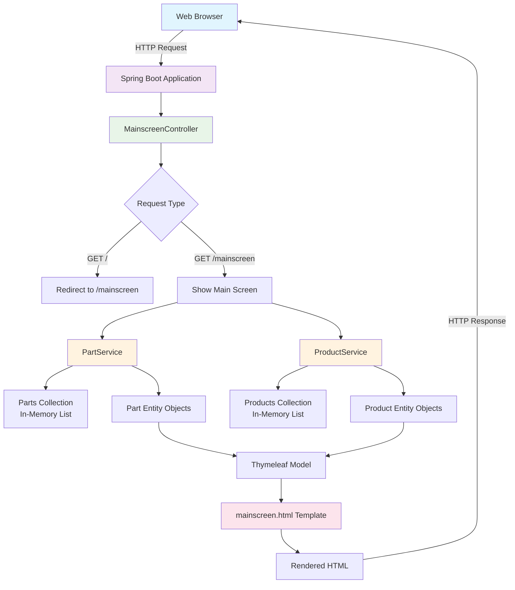
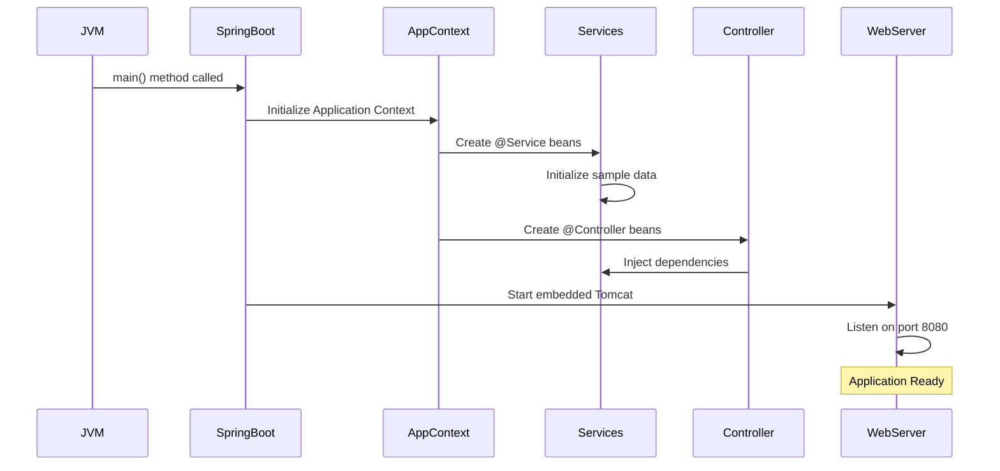
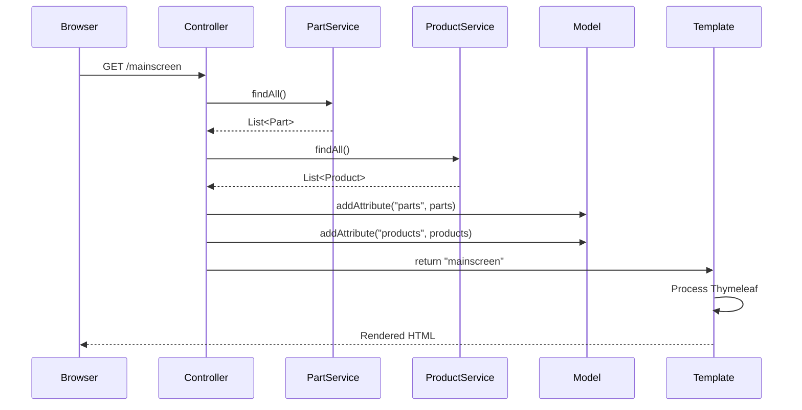

# Alfonso's Auto Parts Shop - Project Architecture Schema

## 🏗️ Project Overview
This is a Spring Boot web application for inventory management of auto parts and products, featuring a complete MVC architecture with service layers and entity management.

---

## 📁 Project Structure Schema

```
Java Frameworks/
├── 🔧 Core Application (src/main/java/com/example/inventory/)
│   ├── 🚀 InventoryApplication.java          # Main Spring Boot entry point
│   ├── 🎮 MainscreenController.java          # Web controller for UI requests
│   ├── 📦 entity/
│   │   ├── Part.java                         # Part entity model
│   │   └── Product.java                      # Product entity model
│   └── 💼 service/
│       ├── PartService.java                  # Business logic for parts
│       └── ProductService.java               # Business logic for products
│
├── 🌐 Web Resources (src/main/resources/)
│   └── templates/
│       └── mainscreen.html                   # Thymeleaf template for UI
│
├── ⚙️ Configuration
│   └── pom.xml                              # Maven dependencies & build config
│
└── 📚 Exercise Files (PartA-PartK/)
    ├── Various part implementations
    ├── Controller examples
    ├── Form handlers
    └── Validation examples
```

---

## 🔄 Application Architecture Flow



---

## 🏛️ MVC Architecture Pattern

```
┌─────────────────────────────────────────────────────────────┐
│                         VIEW LAYER                          │
├─────────────────────────────────────────────────────────────┤
│  📱 mainscreen.html (Thymeleaf Template)                   │
│  • Displays parts inventory table                          │
│  • Displays products table                                 │
│  • Provides navigation and action buttons                  │
│  • Uses Bootstrap/CSS for styling                          │
└─────────────────────────────────────────────────────────────┘
                               ↕️
┌─────────────────────────────────────────────────────────────┐
│                      CONTROLLER LAYER                       │
├─────────────────────────────────────────────────────────────┤
│  🎮 MainscreenController.java                              │
│  • @Controller annotation                                  │
│  • @GetMapping("/") - Home redirect                        │
│  • @GetMapping("/mainscreen") - Main page                  │
│  • Dependency injection of services                        │
│  • Model population for view                               │
└─────────────────────────────────────────────────────────────┘
                               ↕️
┌─────────────────────────────────────────────────────────────┐
│                      SERVICE LAYER                          │
├─────────────────────────────────────────────────────────────┤
│  💼 PartService.java        💼 ProductService.java         │
│  • @Service annotation      • @Service annotation          │
│  • Business logic          • Business logic               │
│  • CRUD operations         • CRUD operations              │
│  • Data validation         • Data validation              │
│  • Sample data init        • Sample data init             │
└─────────────────────────────────────────────────────────────┘
                               ↕️
┌─────────────────────────────────────────────────────────────┐
│                        MODEL LAYER                          │
├─────────────────────────────────────────────────────────────┤
│  📦 Part.java              📦 Product.java                 │
│  • Entity properties       • Entity properties             │
│  • Getters/Setters        • Getters/Setters               │
│  • Business rules         • Business rules                │
│  • Relationships          • Relationships                 │
└─────────────────────────────────────────────────────────────┘
```

---

## 🔗 Component Relationships

```
┌──────────────────────────────────────────────────────────────┐
│                    SPRING BOOT CONTAINER                     │
│                                                              │
│  ┌─────────────────┐    ┌─────────────────┐                │
│  │  PartService    │    │ ProductService  │                │
│  │  @Service       │    │  @Service       │                │
│  │  • findAll()    │    │  • findAll()    │                │
│  │  • findById()   │    │  • findById()   │                │
│  │  • save()       │    │  • save()       │                │
│  │  • deleteById() │    │  • deleteById() │                │
│  └─────────────────┘    └─────────────────┘                │
│           ↑                       ↑                        │
│           │                       │                        │
│           └───────────┬───────────┘                        │
│                       │                                    │
│            ┌─────────────────────┐                         │
│            │ MainscreenController│                         │
│            │     @Controller     │                         │
│            │ • showMainScreen()  │                         │
│            │ • home()            │                         │
│            └─────────────────────┘                         │
│                       │                                    │
│                       ↓                                    │
│            ┌─────────────────────┐                         │
│            │   Thymeleaf View    │                         │
│            │  mainscreen.html    │                         │
│            └─────────────────────┘                         │
└──────────────────────────────────────────────────────────────┘
```

---

## 📊 Data Model Schema

```
┌─────────────────────────────────────┐
│              Part Entity             │
├─────────────────────────────────────┤
│ 🔑 id: Long                         │
│ 📝 name: String                     │
│ 💰 price: double                    │
│ 📦 inv: int (current inventory)     │
│ ⬇️  min: int (minimum threshold)    │
│ ⬆️  max: int (maximum threshold)    │
│ 🔗 products: Set<Product>           │
└─────────────────────────────────────┘
                    │
                    │ Many-to-Many
                    │ Relationship
                    │
┌─────────────────────────────────────┐
│           Product Entity            │
├─────────────────────────────────────┤
│ 🔑 id: Long                         │
│ 📝 name: String                     │
│ 💰 price: double                    │
│ 📦 inv: int (current inventory)     │
│ 🔗 parts: Set<Part>                 │
└─────────────────────────────────────┘

Inheritance Hierarchy:
┌─────────────────┐
│      Part       │
│   (Base Class)  │
└─────────────────┘
         ↑
    ┌────┴────┐
    │         │
┌───────┐ ┌──────────┐
│InHouse│ │Outsourced│
│ Part  │ │   Part   │
└───────┘ └──────────┘
```

---

## 🚀 Application Startup Flow



---

## 🌊 Request-Response Flow



---

## 🔧 Technology Stack Integration

```
┌─────────────────────────────────────────────────────────────┐
│                    TECHNOLOGY LAYERS                        │
├─────────────────────────────────────────────────────────────┤
│ 🌐 Presentation: HTML5 + CSS + Thymeleaf                   │
│ 🎮 Web Layer: Spring MVC (@Controller)                     │
│ 💼 Business: Spring Service (@Service)                     │
│ 📦 Domain: POJOs (Part, Product entities)                  │
│ 🗄️  Data: In-Memory Collections (List<>)                   │
│ ⚙️  Framework: Spring Boot + Auto-configuration            │
│ 🚀 Server: Embedded Tomcat                                 │
│ 🔨 Build: Maven                                            │
│ ☕ Runtime: Java 17+                                       │
└─────────────────────────────────────────────────────────────┘
```

---

## 📋 Key Features Summary

### ✅ Implemented Features:
- ✅ Spring Boot application with auto-configuration
- ✅ MVC architecture with clear separation of concerns
- ✅ Dependency injection for loose coupling
- ✅ Service layer for business logic
- ✅ Entity models with proper encapsulation
- ✅ Thymeleaf templating for dynamic HTML
- ✅ Responsive web interface
- ✅ In-memory data storage with sample data
- ✅ RESTful URL patterns
- ✅ Professional code documentation

### 🔄 Data Flow:
1. **HTTP Request** → Spring DispatcherServlet
2. **Routing** → MainscreenController
3. **Business Logic** → Service Layer (PartService, ProductService)
4. **Data Retrieval** → In-memory collections
5. **Model Population** → Spring Model
6. **View Rendering** → Thymeleaf Template Engine
7. **HTTP Response** → Rendered HTML to browser

### 🏗️ Design Patterns Used:
- **MVC (Model-View-Controller)** - Application architecture
- **Dependency Injection** - Spring IoC container
- **Service Layer** - Business logic separation
- **Template Method** - Thymeleaf rendering
- **Factory Pattern** - Spring bean creation

This schema shows how Alfonso's Auto Parts Shop is a well-structured Spring Boot application that follows industry best practices for enterprise web development.